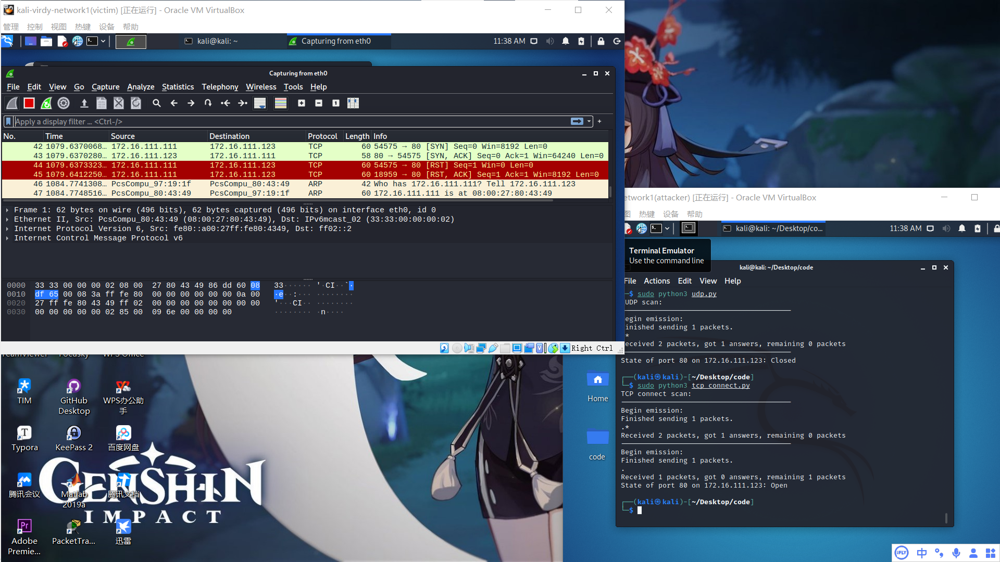
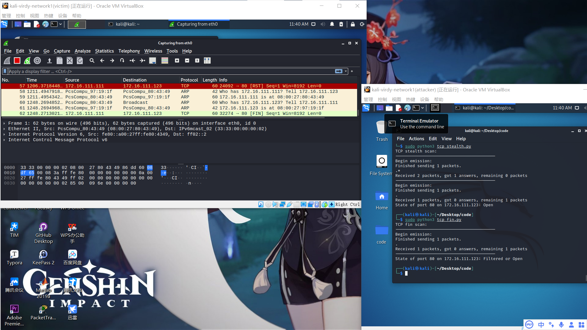

# 基于Scapy编写端口扫描器

## 实验目的

+ 掌握网络扫描之端口状态探测的基本原理

## 实验环境

+ Python + scapy
+ 攻击者主机：kali 2021（#intnet1：172.16.111.111）
+ 受害者主机：kali 2021（#intnet1：172.16.111.123）
+ 网关：debian 4.19.0 （#intnet1：172.16.111.1）

## 实验要求

- [x] 禁止探测互联网上的 IP ，严格遵守网络安全相关法律法规

- [x] 完成以下扫描技术的编程实现

  - [x] TCP connect scan / TCP stealth scan

  - [x] TCP Xmas scan / TCP fin scan / TCP null scan

  - [x] UDP scan

- [ ] 上述每种扫描技术的实现测试均需要测试端口状态为：`开放`、`关闭` 和 `过滤` 状态时的程序执行结果

- [x] 提供每一次扫描测试的抓包结果并分析与课本中的扫描方法原理是否相符？如果不同，试分析原因；

- [x] 在实验报告中详细说明实验网络环境拓扑、被测试 IP 的端口状态是如何模拟的

- [ ] （可选）复刻 `nmap` 的上述扫描技术实现的命令行参数开关

## 实验准备

端口的开启/关闭/过滤设置：

开放：nc -l -p80

ctrl+C关闭

过滤：iptables -A INPUT -p tcp --dport 80 -j REJECT

iptables -t filter -F清空

## 实验过程

+ ### TCP connect scan

  ###### 扫描原理

  

  ###### 代码实现

   [tcp_connect.py](code/tcp_connect.py) 

  ###### 实现结果

  + 端口关闭时

    

  + 端口开放时

    

  + 端口过滤时

  与课本结果相符

+ ### TCP stealth scan

  ###### 扫描原理

  

  ###### 代码实现

    [tcp_stealth.py](code/tcp_stealth.py) 

  ###### 实现结果

  + 端口关闭时

    

  + 端口开放时

    

  + 端口过滤时

    与课本结果相符

+ ### TCP Xmas Scan

  ###### 扫描原理

  

  ###### 代码实现

   [tcp_xmas.py](code/tcp_xmas.py) 

  ###### 实现结果

  + 端口关闭时

    

  + 端口开放时

    

  + 端口过滤时

+ ### TCP fin scan

  ###### 扫描原理

  

  ###### 代码实现

   [tcp_fin.py](code/tcp_fin.py) 

  ###### 实现结果

  + 端口关闭时

    

  + 端口开放时

    

  + 端口过滤时

    与课本结果相符

+ ### TCP null scan

  ###### 扫描原理

  

  ###### 代码实现

   [tcp_null.py](code/tcp_null.py) 

  ###### 实现结果

  + 端口关闭时

    

  + 端口开放时

    

  + 端口过滤时

    与课本结果相符

+ ### UDP scan

  ###### 扫描原理

###### 		代码实现

 	[udp.py](code/udp.py) 

###### 实现结果

+ 端口关闭时

  

+ 端口开放时

  

+ 端口过滤时

  与课本结果相符

## 参考资料

[nmap原理](https://nmap.org/book/synscan)

[浅谈端口扫描技术](https://blog.zeddyu.info/2019/06/12/Scanner/)

[往届师哥的作业](https://github.com/CUCCS/2018-NS-Public-TheMasterOfMagic/tree/ns-chap0x05/ns/chap0x05)

[课本](https://c4pr1c3.github.io/cuc-ns/chap0x05/main.html)

