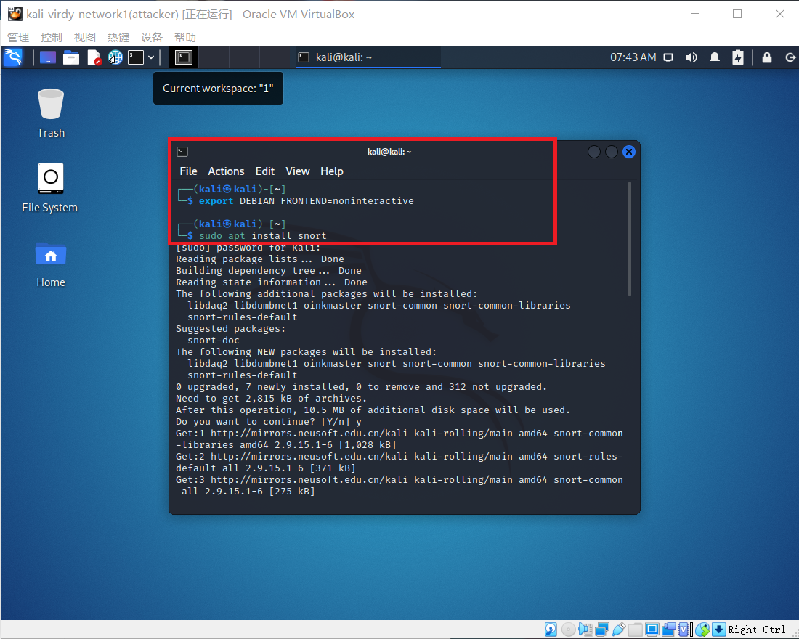
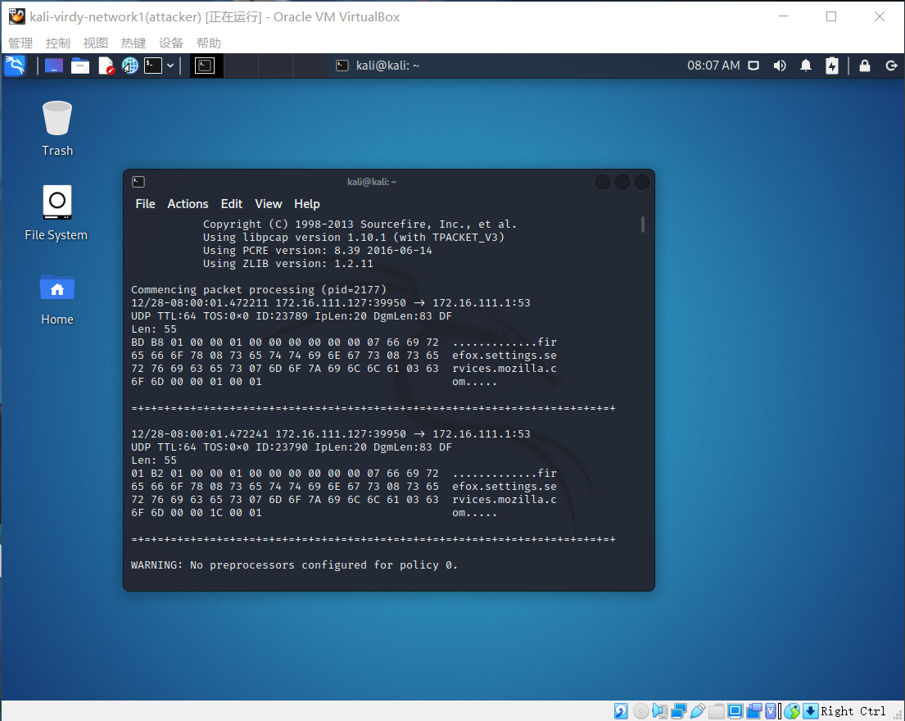

# 入侵检测

### 实验目的

使用Snort进行入侵检测

### 实验准备

###### 主机信息

+ VM-1：kali-virdy-network1(attackr)    172.16.111.127

### 实验流程

#### Snort安装

> ```bash
> # 禁止在apt安装时弹出交互式配置界面
> export DEBIAN_FRONTEND=noninteractive
> 
> sudo apt install snort
> ```

根据用户组权限的实际情况考虑是否需要使用'sudo'提高权限，一般情况下不建议使用



#### 实验一：配置snort为嗅探模式

> ```bash
> # 显示IP/TCP/UDP/ICMP头
> snort -v
> ```

> ```bash
> # 显示应用层数据
> snort -vd
> ```

> ```bash
> # 显示数据链路层报文头
> snort -vde
> ```

> ```bash
> # -b 参数表示报文存储格式为 tcpdump 格式文件
> # -q 静默操作，不显示版本欢迎信息和初始化信息
> snort -q -v -b -i eth1 "port not 22"
> ```





#### 实验二：配置并应用snort内置规则

> ```bash
> # /etc/snort/snort.conf 中的 HOME_NET 和 EXTERNAL_NET 需要正确定义
> sudo vim /etc/snort/snort.conf
> # 将上述两个变量值均设置为 any
> snort -q -A console -b -i eth0 -c /etc/snort/snort.conf -l /var/log/snort/
> ```


#### 实验三：自定义snort规则

> ```bash
> # 新建自定义 snort 规则文件
> cat << EOF > /etc/snort/rules/cnss.rules
> alert tcp \$EXTERNAL_NET any -> \$HTTP_SERVERS 80 (msg:"Access Violation has been detected on /etc/passwd ";flags: A+; content:"/etc/passwd"; nocase;sid:1000001; rev:1;)
> alert tcp \$EXTERNAL_NET any -> \$HTTP_SERVERS 80 (msg:"Possible too many connections toward my http server"; threshold:type threshold, track by_src, count 100, seconds 2; classtype:attempted-dos; sid:1000002; rev:1;)
> EOF
> ```

> ```bath
> # 添加配置代码:‘include $RULE_PATH/cnss.rules’到 /etc/snort/snort.conf
> sudo vim /etc/snort/snort.conf
> ```

> ```bash
> # 启用自定义规则
> snort -q -A fast -b -i eth0 -c /etc/snort/snort.conf -l /var/log/snort/
> ```


#### 实验四：和防火墙联动

###### 主机信息

+ 网关：debian-virdy    							172.16.111.1

+ VM-1：kali-virdy-network1(attackr)    172.16.111.127

+ VM-2：kali-virdy-network(victim)        172.16.111.123

###### 网络拓扑


###### 脚本代码预下载与解压

> ```bash
> # 下载 Guardian-1.7.tar.gz 
> curl -o guardian.tar.gz https://c4pr1c3.github.io/cucns/chap0x09/attach/guardian.tar.gz
> 
> # 解压缩 Guardian-1.7.tar.gz
> tar zxf guardian.tar.gz
> 
> # 安装 Guardian 的依赖 lib
> apt install libperl4-corelibs-perl
> ```

在VM-2上下载并开启snort

> ```bash
> sudo apt install snort
> snort -q -A fast -b -i eth0 -c /etc/snort/snort.conf -l /var/log/snort/
> ```

编辑guardian.conf，确认以下两个参数符合主机的实际环境

> ```bash
> cd /root/guardian
> vim guardian.conf
> ```

```ini
HostIpAddr      172.16.111.127
Interface       eth0
```

启动guardian.pl

> ```bash
> perl guardian.pl -c guardian.conf
> ```

在VM-1上用 `nmap` 暴力扫描 VM-2：

> ```bash
> nmap 172.16.111.123 -A -T4 -n -vv
> ```


防火墙状态：

> ```bash
> iptables -L -n
> ```


一分钟后：

